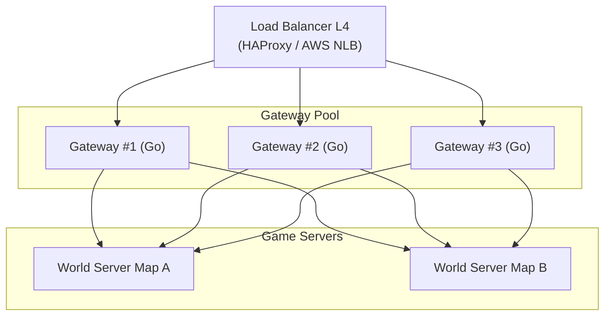

# Revisão Crítica da Arquitetura MMORPG — Problemas e Soluções

> [!IMPORTANT]
> Este documento identifica **9 pontos fracos** na proposta anterior e apresenta a solução corrigida para cada um.

---

## 🔴 Problema 1: Redis como fonte de estado — Perda de dados em crash

**O que estava errado:** O guia anterior coloca o Redis como armazém do estado quente (HP, posição, mana) e só persiste no PostgreSQL a cada 15 segundos. Se o Redis ou o World Server cair, você perde até 15 segundos de progresso de **todos** os jogadores online — itens dropados, dano recebido, ouro ganho.

**Solução:** O estado autoritativo deve viver **na memória RAM do World Server**, não no Redis. O Redis serve apenas como cache de leitura e canal de comunicação entre serviços. A persistência segue dois caminhos:

```mermaid
sequenceDiagram
    participant GS as World Server (RAM = Fonte da Verdade)
    participant Redis as Redis (Cache de Leitura)
    participant Q as Fila NATS JetStream
    participant DBS as DB Sync Worker
    database PG as PostgreSQL (Write-Ahead Log)

    Note over GS: Estado autoritativo vive na RAM do processo
    GS->>Q: Evento crítico (Trade/LevelUp/Drop Raro)
    Q->>DBS: Consome evento (persistido na fila até confirmação)
    DBS->>PG: UPSERT transacional
    DBS->>Q: ACK (confirma gravação)

    Note over GS: Timer periódico (30s)
    GS->>Q: Snapshot delta de todos os players ativos
    Q->>DBS: Batch write
    DBS->>PG: Bulk UPSERT

    GS->>Redis: Publica posição/HP para leitura externa (chat, ranking)
```

**Por que funciona:** A fila NATS JetStream (ou Kafka) garante **at-least-once delivery**. Se o DB Sync Worker cair, as mensagens ficam na fila e são processadas na volta. Se o World Server cair, o pior caso é perder o delta desde o último snapshot (30s), mas eventos críticos (trades, drops raros) já foram persistidos instantaneamente.

---

## 🔴 Problema 2: gRPC entre Gateway e Game Server — Latência inaceitável

**O que estava errado:** O diagrama anterior mostra gRPC como protocolo entre o Gateway e o World Server para pacotes de gameplay (movimentação, skills). O gRPC usa HTTP/2 + TLS, o que adiciona overhead de ~2-5ms por chamada. Em um jogo com tick rate de 20Hz (50ms por tick), perder 5ms só no transporte interno é inaceitável.

**Solução:** Usar protocolos diferentes para propósitos diferentes:

| Tipo de Tráfego | Protocolo Interno | Justificativa |
|:---|:---|:---|
| Gameplay (posição, skill, combate) | **TCP raw com Protobuf** ou **Unix Domain Sockets** (se co-locados) | Zero overhead de HTTP. Latência < 0.1ms na mesma máquina |
| Serviços de apoio (Auth, Social, Leilão) | **gRPC** | Overhead aceitável para chamadas não-tempo-real |
| Eventos broadcast (chat global, notificações) | **NATS PubSub** | Fan-out eficiente para milhares de subscribers |

---

## 🔴 Problema 3: Ausência de Anti-Cheat — Servidor autoritativo incompleto

**O que estava errado:** Nenhum dos documentos menciona validação server-side. Em um MMORPG, jogadores **vão** tentar hackear. Speed hack, teleport hack, duplicação de itens e damage hack são os mais comuns.

**Solução — 4 camadas de proteção:**

1. **Servidor Autoritativo Estrito:** O cliente envia apenas *intents* ("quero mover para Norte", "quero usar skill X"). O servidor valida se a ação é fisicamente possível (distância, cooldown, line-of-sight) e rejeita silenciosamente ações inválidas.
2. **Rate Limiting por Jogador:** Máximo de N ações por segundo por sessão. Se ultrapassar, desconecta.
3. **Validação de Movimento:** O servidor calcula a velocidade máxima do personagem. Se a posição reportada pelo cliente exceder `velocidade_max * delta_time * 1.15` (15% de tolerância para lag), a posição é corrigida pelo servidor.
4. **Detecção Estatística Assíncrona:** Um worker offline analisa logs de combate procurando anomalias (DPS impossível, movimentação sobre terreno bloqueado). Flags automáticas para revisão de GM.

---

## 🔴 Problema 4: Gateway como Single Point of Failure (SPOF)

**O que estava errado:** O diagrama mostra um único Gateway Proxy. Se ele cair, **todos** os jogadores são desconectados de todas as plataformas simultaneamente.

**Solução:** Múltiplas instâncias de Gateway atrás de um Load Balancer L4:



**Detalhe crítico:** Use **IP-hash** ou **sticky sessions** no Load Balancer para que um jogador sempre reconecte no mesmo Gateway durante a sessão (necessário para manter o estado da conexão WebRTC). Se o Gateway específico cair, o LB redistribui para outro e o cliente faz reconexão automática (o estado do jogador está no World Server, não no Gateway).

---

## 🔴 Problema 5: WebRTC Data Channels — Complexidade subestimada

**O que estava errado:** O guia sugere WebRTC como se fosse plug-and-play. Na realidade, WebRTC exige infraestrutura adicional significativa: servidores **STUN** (para NAT traversal) e **TURN** (para relay quando P2P falha). Além disso, o handshake WebRTC (ICE negotiation) leva 1-3 segundos, o que é lento para reconexões.

**Solução pragmática para 2026:**

- **Web:** Use **WebTransport** (baseado em HTTP/3 + QUIC). Suportado nativamente no Chrome, Edge e Firefox. É UDP-like sem precisar de STUN/TURN. Handshake em ~100ms. Suporta streams confiáveis e não-confiáveis simultaneamente.
- **PC/Mobile (nativos):** Use **KCP sobre UDP** (protocolo usado pelo Genshin Impact) ou **ENet** (usado pelo Minecraft Bedrock). Ambos são leves e battle-tested.
- **Fallback:** Se WebTransport não estiver disponível (Safari, navegadores antigos), caia para WebSocket com compressão.

---

## 🔴 Problema 6: MongoDB para dados de jogador — Risco para economia do jogo

**O que estava errado:** O documento 1 recomenda MongoDB para inventário e dados de jogador. MongoDB não tem transações ACID multi-documento por padrão (existe, mas com overhead). Se um jogador troca um item com outro e o servidor crashar no meio, você pode acabar com o item **duplicado** (os dois jogadores ficam com ele) ou **perdido** (nenhum fica).

**Solução:** Use **PostgreSQL para tudo que envolve economia** (inventário, ouro, trades, leilão, cash shop). O PostgreSQL garante atomicidade com `BEGIN TRANSACTION ... COMMIT`. Use tabelas JSONB para flexibilidade de esquema onde necessário:

```sql
-- Exemplo: inventário flexível com segurança ACID
CREATE TABLE player_inventory (
    player_id   BIGINT REFERENCES players(id),
    slot        INT,
    item_data   JSONB NOT NULL,  -- flexível como MongoDB
    updated_at  TIMESTAMPTZ DEFAULT NOW(),
    PRIMARY KEY (player_id, slot)
);

-- Trade atômico: impossível duplicar ou perder
BEGIN;
  DELETE FROM player_inventory WHERE player_id = 1 AND slot = 5;
  INSERT INTO player_inventory (player_id, slot, item_data)
    VALUES (2, 12, '{"id": 5001, "name": "Espada Sagrada", "enhance": 7}');
COMMIT;
```

**Resultado:** Flexibilidade de schema (JSONB = schema-less como Mongo) + garantia ACID = impossível duplicar itens.

---

## 🔴 Problema 7: Sem estratégia de Seamless World / Transferência entre mapas

**O que estava errado:** O guia fala em "micro-mundos" por mapa, mas não explica como o jogador migra entre eles sem loading screen. Num MMORPG, o jogador espera andar livremente entre zonas.

**Solução — Transferência de Entidade entre World Servers:**

1. Quando o jogador se aproxima da borda entre Map A e Map B, o Gateway começa a enviar os dados de posição dele para **ambos** os World Servers (dual-subscription).
2. O World Server do Map B pré-carrega a entidade do jogador (lê do Redis/PG).
3. Quando o jogador cruza a linha, o Gateway troca o roteamento primário para Map B. O jogador nunca percebe a troca.
4. Map A remove a entidade após 2 segundos de timeout.

Isso é exatamente o conceito do `glinkd` do SSO — a conexão do jogador com o Gateway nunca cai, apenas o roteamento interno muda.

---

## 🔴 Problema 8: Sem plano de observabilidade e economia do jogo

**O que estava errado:** O guia menciona "Grafana + Prometheus" superficialmente, mas não define **o que** monitorar. Sem métricas, você não detecta exploits de economia (farm bots, duping) até que seja tarde demais.

**Métricas obrigatórias para um MMORPG:**

| Categoria | Métrica | Alerta |
|:---|:---|:---|
| **Rede** | Latência p99 Gateway→GS | > 10ms |
| **Rede** | Conexões ativas por Gateway | > 80% capacidade |
| **Gameplay** | Ações por segundo por jogador | > 30 (possível bot/macro) |
| **Economia** | Ouro total gerado vs. removido (gold sink ratio) | Desbalanceado > 5% |
| **Economia** | Trades por minuto entre mesmos 2 jogadores | > 10 (possível RMT/bot) |
| **Performance** | Tick rate real do World Server | < 18 ticks/s (alvo: 20) |
| **Persistência** | Fila de gravação pendente (NATS) | > 10.000 mensagens |

---

## 🔴 Problema 9: Escalabilidade horizontal do World Server não detalhada

**O que estava errado:** O guia diz "cada mapa roda em um container", mas não aborda o que acontece quando 3.000 jogadores estão **no mesmo mapa** (ex: evento de boss mundial). Um único processo não aguenta.

**Solução — Spatial Partitioning (Grade Espacial):**

O mapa é dividido em células (quadrantes) de 200x200 unidades. Cada célula pode ser gerenciada por um thread ou, em casos extremos, por um processo separado:

- **Interesse Espacial (Area of Interest - AOI):** O jogador só recebe updates de entidades dentro de um raio de 2 células ao redor dele. Isso reduz o broadcast de N² para ~N*K (onde K é o número médio de vizinhos).
- **Migração dinâmica:** Se uma célula ultrapassar 500 entidades (boss event), o orquestrador divide ela em 4 sub-células automaticamente.

---

## Arquitetura Final Corrigida

```mermaid
graph TD
    subgraph Clientes
        PC["PC (KCP/UDP)"]
        Mob["Mobile (KCP/UDP)"]
        Web["Browser (WebTransport)"]
    end

    LB["Load Balancer L4<br>(HAProxy / NLB)"]

    subgraph Gateway Pool
        GW1["Gateway #1"]
        GW2["Gateway #2"]
    end

    subgraph Microsserviços (gRPC)
        Auth["Auth Service"]
        Social["Social Service"]
        Econ["Economy Service"]
    end

    subgraph World Servers (TCP raw + Protobuf)
        WS1["World: Mapa Principal"]
        WS2["World: Dungeon Pool"]
    end

    NATS["NATS JetStream<br>(Eventos + Fila de Persistência)"]
    Redis[("Redis<br>(Cache AOI + Sessões)")]
    PG[("PostgreSQL<br>(Fonte da Verdade ACID)")]

    Grafana["Grafana + Loki<br>(Observabilidade)"]

    PC & Mob & Web --> LB
    LB --> GW1 & GW2
    GW1 & GW2 -->|TCP raw| WS1 & WS2
    GW1 & GW2 -->|gRPC| Auth & Social & Econ

    WS1 & WS2 <--> NATS
    Social & Econ <--> NATS

    Auth & Econ --> PG
    WS1 & WS2 -->|Snapshots| NATS
    NATS -->|DB Sync Worker| PG

    WS1 & WS2 --> Redis
    Auth --> Redis

    WS1 & WS2 & GW1 & GW2 -.-> Grafana
```

### Mudanças-chave vs. versão anterior:
1. ✅ **Load Balancer L4** na frente do Gateway Pool (elimina SPOF)
2. ✅ **WebTransport** no lugar de WebRTC (sem STUN/TURN)
3. ✅ **TCP raw + Protobuf** entre Gateway↔World Server (sem overhead gRPC)
4. ✅ **PostgreSQL como única fonte de verdade** (ACID para economia)
5. ✅ **NATS JetStream** como fila durável (at-least-once delivery)
6. ✅ **Redis apenas como cache** (não como fonte de estado)
7. ✅ **Grafana/Loki** integrado desde o dia 1
8. ✅ **Economy Service** separado (valida trades/leilão com transações ACID)
