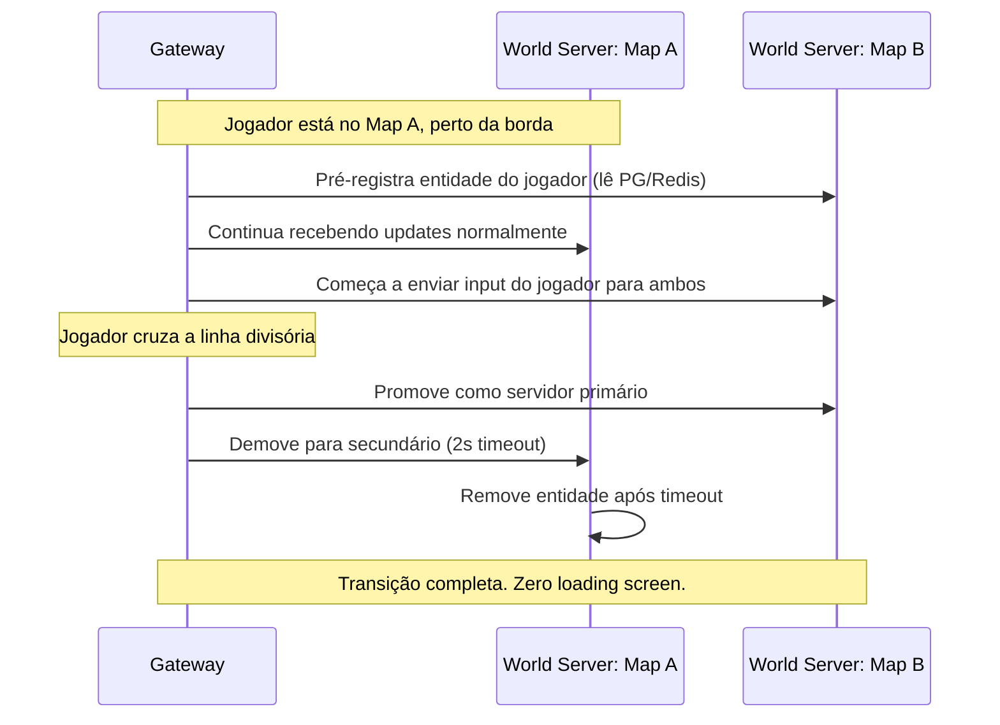

# Guia de Arquitetura: MMORPG Moderno Multiplataforma (PC, Mobile, Web) — v2 Corrigida

Este documento é a versão final corrigida da arquitetura do seu MMORPG, incorporando todas as 9 correções identificadas na revisão crítica.

---

## 1. Princípios Fundamentais (Herdados do SSO)

Dois conceitos da arquitetura do Saint Seiya Online / Perfect World que **devem** ser preservados:

1. **Gateway Persistente:** O cliente nunca se conecta diretamente ao World Server. A conexão é mantida com um Gateway que roteia internamente. Troca de mapa = troca de roteamento, sem reconexão.
2. **Escrita Assíncrona em Batch:** O loop do jogo nunca faz `SELECT`/`UPDATE` no banco relacional. O estado vive na RAM do processo do World Server e é persistido de forma assíncrona via fila durável.

---

## 2. Arquitetura Completa

```mermaid
graph TD
    subgraph Clientes
        PC["PC (KCP/UDP)"]
        Mob["Mobile (KCP/UDP)"]
        Web["Browser (WebTransport / WS fallback)"]
    end

    LB["Load Balancer L4<br>(HAProxy / AWS NLB)<br>Sticky Sessions por IP-Hash"]

    subgraph Gateway Pool (Go / Rust)
        GW1["Gateway #1<br>Terminador de Protocolos"]
        GW2["Gateway #2<br>Terminador de Protocolos"]
        GW3["Gateway #N (auto-scale)"]
    end

    subgraph Microsserviços de Apoio (gRPC)
        Auth["Auth Service<br>(JWT + Sessions)"]
        Social["Social Service<br>(Chat, Guildas, Amigos)"]
        Econ["Economy Service<br>(Trades, Leilão, Cash Shop)"]
        AntiCheat["Anti-Cheat Worker<br>(Análise Assíncrona)"]
    end

    subgraph World Servers (TCP raw + Protobuf)
        WS1["World Server: Open World<br>(Spatial Partitioning / AOI)"]
        WS2["World Server: Dungeon Pool<br>(Instâncias sob demanda)"]
    end

    NATS["NATS JetStream<br>(Fila Durável + PubSub)"]
    Redis[("Redis<br>(Cache AOI + Sessões + Ranking)")]
    PG[("PostgreSQL + JSONB<br>(Fonte da Verdade ACID)")]
    Grafana["Grafana + Loki + Prometheus<br>(Observabilidade)"]

    PC & Mob & Web --> LB
    LB --> GW1 & GW2 & GW3
    GW1 & GW2 & GW3 -->|TCP raw + Protobuf| WS1 & WS2
    GW1 & GW2 & GW3 -->|gRPC| Auth & Social & Econ

    WS1 & WS2 <-->|Eventos| NATS
    Social & Econ <-->|Eventos| NATS
    AntiCheat <-->|Consome Logs| NATS

    Auth & Econ --> PG
    NATS -->|DB Sync Workers| PG
    WS1 & WS2 --> Redis
    Auth --> Redis

    WS1 & WS2 & GW1 & GW2 & GW3 -.->|Métricas + Logs| Grafana
```

---

## 3. Camada de Rede — Multiplataforma sem Complexidade

### Problema resolvido: Navegadores não suportam UDP puro, e WebRTC exige infraestrutura STUN/TURN.

| Plataforma | Protocolo | Justificativa |
|:---|:---|:---|
| **PC (Nativo)** | KCP sobre UDP | Battle-tested (Genshin Impact). Confiável + rápido |
| **Mobile (Nativo)** | KCP sobre UDP | Mesmo SDK do PC. Funciona em 4G/5G/WiFi |
| **Browser** | **WebTransport** (HTTP/3 + QUIC) | UDP-like nativo no navegador. Sem STUN/TURN. Handshake ~100ms |
| **Fallback Browser** | WebSocket + compressão zstd | Para Safari/navegadores antigos sem WebTransport |

### Gateway Pool — Sem ponto único de falha

- Múltiplas instâncias de Gateway atrás de um **Load Balancer L4** (HAProxy ou AWS NLB)
- **Sticky sessions por IP-hash** para manter o jogador no mesmo Gateway durante a sessão
- Se um Gateway cair, o LB redistribui automaticamente. O estado do jogador vive no World Server, não no Gateway — reconexão automática é transparente
- Cada Gateway traduz o protocolo da plataforma (WebTransport/KCP/WS) em **Protobuf padronizado** antes de repassar ao World Server

### Comunicação Interna — Protocolo certo para cada propósito

| Tráfego | Protocolo | Latência |
|:---|:---|:---|
| Gameplay (posição, skill, combate) | **TCP raw + Protobuf** entre Gateway↔World Server | < 0.1ms (mesma rede) |
| Serviços de apoio (Auth, Social, Leilão) | **gRPC** | ~2-5ms (aceitável) |
| Broadcast (chat global, notificações, eventos) | **NATS PubSub** | ~1ms fan-out |

---

## 4. Fluxo de Estado e Persistência — RAM + Fila Durável + PostgreSQL

### Problema resolvido: Redis como fonte de estado causa perda de dados em crash.

**Regra de Ouro:** A RAM do World Server é a fonte da verdade durante o gameplay. O PostgreSQL é a fonte da verdade permanente. O Redis é apenas cache de leitura.

```mermaid
sequenceDiagram
    autonumber
    actor P as Cliente
    participant GW as Gateway
    participant WS as World Server (RAM = Estado)
    participant Q as NATS JetStream (Fila Durável)
    participant W as DB Sync Worker
    database PG as PostgreSQL

    P->>GW: Input (Mover / Skill)
    GW->>WS: Repassa (Protobuf via TCP raw)
    Note over WS: Processa na RAM:<br/>Física, IA, Dano, Colisão
    WS-->>GW: Snapshot do mundo (delta compression)
    GW-->>P: Renderiza (Client Prediction)

    Note over WS: Evento crítico (Trade, Drop Raro, Level Up)
    WS->>Q: Publica evento (persistido na fila até ACK)
    Q->>W: Consome evento
    W->>PG: UPSERT transacional (ACID)
    W->>Q: ACK ✓

    Note over WS: Timer periódico (30 segundos)
    WS->>Q: Snapshot delta de todos os players online
    Q->>W: Batch consume
    W->>PG: Bulk UPSERT
```

### Por que funciona:
- **Eventos críticos** (trades, drops raros, compras de cash) são persistidos **instantaneamente** via fila durável
- **Snapshots periódicos** (posição, HP, mana) salvam a cada 30 segundos
- Se o World Server crashar, o pior caso é perder 30s de progresso em posição/HP — mas nenhum item ou transação econômica se perde
- Se o DB Sync Worker crashar, as mensagens ficam retidas na fila NATS JetStream e são processadas na volta (at-least-once delivery)

### PostgreSQL com JSONB — Flexível como MongoDB, Seguro como SQL

```sql
-- Inventário flexível com proteção ACID
CREATE TABLE player_inventory (
    player_id   BIGINT REFERENCES players(id),
    slot        SMALLINT,
    item_data   JSONB NOT NULL,
    updated_at  TIMESTAMPTZ DEFAULT NOW(),
    PRIMARY KEY (player_id, slot)
);

-- Trade atômico: impossível duplicar ou perder itens
BEGIN;
  DELETE FROM player_inventory WHERE player_id = 101 AND slot = 5;
  INSERT INTO player_inventory (player_id, slot, item_data)
    VALUES (202, 12, '{"id": 5001, "name": "Espada Sagrada", "enhance": 7}');
COMMIT;
```

---

## 5. Anti-Cheat — 4 Camadas de Proteção

### Problema resolvido: Sem validação server-side, qualquer hacker destrói a economia.

| Camada | Tipo | Implementação |
|:---|:---|:---|
| 1. **Servidor Autoritativo** | Prevenção | Cliente envia *intents* ("mover Norte"). Servidor valida fisicamente (distância, cooldown, line-of-sight) e rejeita ações impossíveis |
| 2. **Rate Limiting** | Prevenção | Máximo de 25 ações/segundo por sessão. Excedeu = desconexão + flag |
| 3. **Validação de Movimento** | Detecção | `if (distância_reportada > vel_max * delta * 1.15)` → corrige posição no servidor. Tolerância de 15% para lag |
| 4. **Análise Assíncrona** | Detecção | Worker consome logs de combate via NATS. Detecta DPS impossível, farm patterns de bot, RMT (Real Money Trading) |

---

## 6. Seamless World — Transição entre Mapas sem Loading Screen

### Problema resolvido: Micro-mundos separados sem estratégia de migração.

O jogador anda livremente entre zonas usando **dual-subscription + handoff**:



**Chave:** O Gateway mantém a conexão de rede com o jogador intacta durante toda a transição. Apenas o roteamento interno muda. Isso é exatamente o que o `glinkd` do SSO fazia.

---

## 7. Escalabilidade — Spatial Partitioning para Mapas Lotados

### Problema resolvido: 3000 jogadores no mesmo mapa crasham o servidor.

**Area of Interest (AOI)** com Grade Espacial:
- O mapa do Open World é dividido em **células de 200×200 unidades**
- Cada jogador só recebe updates de entidades dentro de um **raio de 2 células** ao redor dele
- Isso reduz o broadcast de **O(N²)** para **O(N×K)**, onde K ≈ 50 vizinhos típicos

**Subdivisão dinâmica para eventos de boss:**
- Se uma célula ultrapassar 500 entidades, o orquestrador a divide em 4 sub-células
- Cada sub-célula pode ser processada em threads paralelas ou, em casos extremos, distribuída para outro processo

---

## 8. Observabilidade — Métricas Obrigatórias desde o Dia 1

| Categoria | Métrica | Alerta Crítico |
|:---|:---|:---|
| **Rede** | Latência p99 Gateway→WS | > 10ms |
| **Rede** | Conexões ativas por Gateway | > 80% capacidade |
| **Gameplay** | Ações por segundo por jogador | > 30 (bot/macro) |
| **Economia** | Gold gerado vs. removido (sink ratio) | Desbalanceado > 5% |
| **Economia** | Trades/min entre mesmos 2 jogadores | > 10 (possível RMT) |
| **Performance** | Tick rate real do World Server | < 18 ticks/s (alvo: 20) |
| **Persistência** | Fila pendente NATS JetStream | > 10.000 mensagens |
| **Anti-Cheat** | Flags de speed hack por hora | > 50 (ataque coordenado) |

**Stack:** Prometheus (coletor de métricas) + Grafana (dashboards) + Loki (logs agregados)

---

## 9. Stack Tecnológico Final (2026)

| Componente | Tecnologia | Alternativa |
|:---|:---|:---|
| Engine do Cliente | **Godot 4.x** (melhor Web/WebGPU) | Unity 6 (maior ecossistema) |
| Exportação Web | **WebGPU** (Godot/Unity) | WebGL2 fallback |
| Gateway | **Go** (goroutines) | Rust (Tokio async) |
| World Server | **C# Headless** (Godot/Unity) | C++ (máxima performance) |
| Protocolo Externo | **WebTransport** (Web) + **KCP/UDP** (Nativo) | WebSocket fallback |
| Protocolo Interno | **TCP raw + Protobuf** (gameplay) + **gRPC** (serviços) | — |
| Message Broker | **NATS JetStream** | Kafka (se escala muito grande) |
| Cache | **Redis** (sessões, AOI, ranking) | Dragonfly (drop-in Redis mais rápido) |
| Banco de Dados | **PostgreSQL + JSONB** | — |
| Orquestração | **Kubernetes + Agones** | Docker Compose (dev local) |
| Observabilidade | **Grafana + Prometheus + Loki** | Datadog (SaaS pago) |
| CI/CD | **GitHub Actions + ArgoCD** | GitLab CI |
