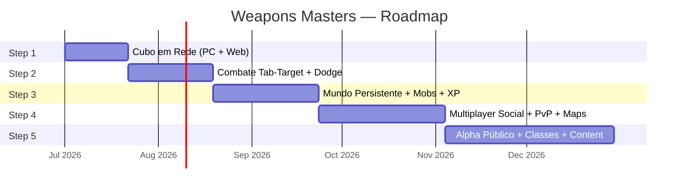

# Weapons Masters — Roadmap de Implementação

> [!IMPORTANT]
> **Regra #1:** Cada Step termina com algo **jogável**. Se você não consegue abrir o jogo e testar no final do Step, algo deu errado.
>
> **Regra #2:** Não pule Steps. Cada um depende do anterior.
>
> **Regra #3:** Não adicione features que não estão no Step atual. Anote ideias num backlog e siga em frente.

---

## Step 1 — O Cubo que Anda em Rede (2-3 semanas)

### Objetivo
Um cubo 3D controlável no Godot que se move em tempo real, com posição autoritativa vinda de um servidor Rust. Funciona no PC e no navegador. **Zero arte. Zero combate. Zero banco de dados.**

### Por que isso primeiro?
Se a rede não funcionar, nada funciona. Este step valida que Rust ↔ Godot C# se comunicam via Protobuf, que WebTransport funciona no browser e que o game loop do servidor roda com tick estável.

### Entregas

```
✅ Repositório Git criado com a estrutura de pastas do projeto
✅ Proto: PlayerInput + WorldSnapshot definidos e compilando em ambos os lados
✅ Server Rust: game loop a 30Hz rodando em std::thread
✅ Server Rust: Gateway aceitando 1 conexão WebTransport (wtransport)
✅ Server Rust: recebe input → atualiza posição na RAM → envia snapshot
✅ Client Godot C#: envia input (WASD) → recebe snapshot → move o cubo
✅ Client Godot C#: exporta para Web (WebGPU/WASM) e funciona no Chrome
✅ Client Godot C#: client-side prediction básica (cubo anda antes do server confirmar)
```

### Tarefas (checklist)

- [ ] `cargo init` no workspace Rust com crates `core` e `network`
- [ ] Escrever `game_messages.proto` (PlayerInput, WorldSnapshot, EntityState, Vec2)
- [ ] Configurar `build.rs` com `prost-build`
- [ ] Implementar game loop com `std::thread::spawn` + `mpsc::channel`
- [ ] Struct `World` simples: `HashMap<EntityId, Position>`
- [ ] `MovementSystem`: recebe input → atualiza posição (velocidade fixa)
- [ ] Gateway com `wtransport`: aceita 1 conexão, lê Protobuf, envia snapshots
- [ ] Projeto Godot 4.x com C# + `Google.Protobuf` NuGet
- [ ] Cena com 1 player (CharacterBody3D + MeshInstance3D) + câmera
- [ ] `NetworkManager.cs`: conecta via WebTransport, envia inputs
- [ ] `InputSender.cs`: captura WASD → serializa `PlayerInput` → envia
- [ ] `PacketHandler.cs`: deserializa `WorldSnapshot` → atualiza posição do cubo
- [ ] `ClientPrediction.cs`: aplica input localmente antes da confirmação do server
- [ ] Testar: rodar server local + cliente PC + cliente no Chrome (export Web)
- [ ] Commit: **"Step 1 done — networked cube moving on PC and Web"**

### Critério de Pronto
Abrir dois clientes (1 PC + 1 browser) apontando para o mesmo servidor. Ambos veem o cubo do outro se movendo em tempo real com menos de 100ms de latência percebida.

---

## Step 2 — Combate Tab-Target entre 2 Jogadores (3-4 semanas)

### Objetivo
Dois jogadores se veem no mundo. Um seleciona o outro como alvo (Tab) e usa uma skill. O alvo pode esquivar (dodge roll). Dano é calculado no servidor. HP aparece na tela. **Zero arte final. Capsules/cubos com cores diferentes.**

### Por que isso segundo?
Este step valida o modelo de combate inteiro: Tab-Target + dodge ativo + servidor autoritativo + lag compensation. Se o "feel" do combate não funcionar aqui, precisa ser corrigido antes de adicionar qualquer outra coisa.

### Entregas

```
✅ Server: ECS com bevy_ecs (Entity, Components: Position, Health, CombatState)
✅ Server: SpatialHash para LoS check
✅ Server: Skill system — 2 skills básicas (melee range + ranged)
✅ Server: Dodge system com i-frames (invulnerabilidade de 300ms)
✅ Server: Lag compensation (rewind buffer de 200ms)
✅ Server: Validação autoritativa (range check, cooldown check, LoS check)
✅ Client: Tab-targeting (selecionar outro jogador)
✅ Client: UI de HP bar (over-head + HUD)
✅ Client: Animação de dodge (roll ou dash lateral)
✅ Client: Feedback visual de hit (flash vermelho, número de dano)
✅ Client: Interpolação de snapshot para o outro jogador (movimento suave)
✅ Proto: atualizado com SkillUse, DamageEvent, DodgeEvent
```

### Tarefas (checklist)

- [ ] Migrar `HashMap<EntityId, Position>` para `bevy_ecs::World`
- [ ] Components: `Position`, `Velocity`, `Health`, `CombatState`, `DodgeState`, `TargetSelection`
- [ ] Systems: `MovementSystem`, `CombatSystem`, `DodgeSystem`, `DeathSystem`
- [ ] `SpatialHash` (~100 linhas): grid de células, `get_neighbors(pos)`
- [ ] `SkillDefinition` (struct): range, cooldown, damage, cast_time
- [ ] 2 skills hardcoded: "Golpe" (melee 3m) e "Disparo" (ranged 15m)
- [ ] `check_tab_target_hit()` — range + LoS + dodge + damage calc (função pura)
- [ ] `PositionHistory` ring buffer para lag compensation (12 frames × 30Hz = 400ms)
- [ ] `process_skill_with_rewind()` — rebobina posição do alvo
- [ ] Rate limiter no Gateway (30 inputs/s por sessão)
- [ ] Proto: adicionar `SkillUse`, `DamageEvent`, `DodgeResult`, `HealthUpdate`
- [ ] Client: raycast para tab-target (clique no outro jogador)
- [ ] Client: barra de HP sobre a cabeça do alvo
- [ ] Client: tecla de dodge (Espaço) com cooldown visual
- [ ] Client: número de dano flutuante (Label3D + tween de fade)
- [ ] **Teste fundamental**: 2 jogadores lutando. Um usa skill, outro esquiva. O servidor decide quem acertou.
- [ ] Commit: **"Step 2 done — tab-target combat with dodge working"**

### Critério de Pronto
Dois jogadores conectados. Player A seleciona Player B, usa "Disparo". Player B faz dodge roll. Se o timing do dodge foi correto (dentro dos i-frames), o dano não é aplicado. Se foi tarde, o dano aparece. **A decisão é do servidor, não do cliente.**

---

## Step 3 — Mundo Persistente com Mobs e Progressão (4-5 semanas)

### Objetivo
Um mapa aberto com mobs que dão XP. O jogador ganha nível, equipa itens e seu progresso é salvo no PostgreSQL. Ao deslogar e relogar, tudo está lá. **Arte básica pode começar aqui (low-poly ou asset packs).**

### Por que isso terceiro?
Combate sem progressão é uma tech demo. Este step transforma o Weapons Masters em um **jogo**. Também valida todo o pipeline de persistência (RAM → NATS → PostgreSQL).

### Entregas

```
✅ Server: IA básica de mobs (spawn, patrol, aggro, attack, respawn)
✅ Server: Sistema de XP + Level Up
✅ Server: Inventário (5-10 slots) com itens dropáveis
✅ Server: Persistência via NATS JetStream → PostgreSQL
✅ Server: Login/Auth básico (username + password → JWT)
✅ Server: Carregamento do personagem do banco ao logar
✅ Server: Graceful shutdown (flush de estado antes de desligar)
✅ Client: Login screen (username + password)
✅ Client: Mapa básico (terreno + árvores low-poly ou assets gratuitos)
✅ Client: Mobs visíveis com HP bar + IA (andam, atacam)
✅ Client: Inventário UI (grid de slots)
✅ Client: Barra de XP + indicador de nível
✅ Docker Compose: server + PostgreSQL + Redis + NATS (dev local)
```

### Tarefas (checklist)

- [ ] `docker/compose.yml` com PostgreSQL 16, Redis 7, NATS com JetStream
- [ ] Schema SQL: `players`, `player_inventory`, `player_stats`
- [ ] Crate `persistence`: `SnapshotWriter` (batch UPSERT a cada 30s)
- [ ] Crate `persistence`: `EventWriter` (level up, drop, trade → UPSERT imediato)
- [ ] Crate `services/auth`: registro + login → JWT (15 min) + refresh token (Redis)
- [ ] `MobAI` system: StateMachine (Idle → Patrol → Aggro → Attack → Dead → Respawn)
- [ ] `LootTable`: ao matar mob, rola loot e adiciona ao inventário do jogador
- [ ] `ExperienceSystem`: XP por mob killed → level up com stat scaling
- [ ] Proto: `LoginRequest/Response`, `CharacterData`, `InventoryUpdate`, `LevelUp`
- [ ] Client: tela de login com 2 campos + botão
- [ ] Client: carregar mundo após login (recebe `CharacterData` do server)
- [ ] Client: painel de inventário (abre com "I") — grid com ícones placeholder
- [ ] Client: mob meshes (capsules ou assets low-poly gratuitos)
- [ ] Client: mapa com terreno básico (Godot terrain ou mesh importada)
- [ ] Testar: criar conta → logar → matar 5 mobs → ganhar nível → deslogar → relogar → progresso mantido
- [ ] Testar: matar servidor (Ctrl+C) → graceful shutdown → progresso salvo
- [ ] Commit: **"Step 3 done — persistent world with mobs, XP, inventory"**

### Critério de Pronto
Criar conta, logar, matar mobs, subir de nível, pegar loot. Fechar o jogo. Reabrir. Todo o progresso está lá. Matar o servidor com Ctrl+C e reiniciar — nenhum dado perdido.

---

## Step 4 — Multiplayer Real: Social, PvP e Múltiplos Mapas (5-6 semanas)

### Objetivo
10+ jogadores jogando simultaneamente com chat, PvP, transição entre 2 mapas (seamless) e sistema de trade. O anti-cheat básico funciona. **Assets visuais mais elaborados. UI polida.**

### Por que isso quarto?
Este step é o "stress test real". Tudo que funcionava com 2 jogadores precisa funcionar com 10-20. Race conditions, edge cases de rede e problemas de escala aparecem aqui.

### Entregas

```
✅ Server: 2 World Servers rodando (Map A + Map B)
✅ Server: Seamless transition entre mapas (dual-subscription + handoff)
✅ Server: Chat system via NATS PubSub (local + global)
✅ Server: Trade system (troca de itens P2P com confirmação ACID)
✅ Server: Economy Service separado (valida trades no PostgreSQL)
✅ Server: Reconexão do jogador (30s timeout, estado preservado)
✅ Server: Anti-cheat layer 1-3 (speed hack, rate limit, dodge spam)
✅ Server: Gateway Pool (2 instâncias)
✅ Server: Métricas Prometheus + dashboards Grafana
✅ Client: Chat window (mensagens locais e globais)
✅ Client: Trade UI (arrastar item + confirmar)
✅ Client: Reconexão automática (overlay "Reconectando...")
✅ Client: Transição suave entre mapas
✅ Client: Mobile build funcional (Android APK)
```

### Tarefas (resumo — expandir conforme necessário)

- [ ] Segundo World Server como processo separado (mesmo binário, config diferente)
- [ ] Gateway roteando para WS correto baseado no mapa do jogador
- [ ] Implementar dual-subscription para seamless transition
- [ ] Chat via NATS: `chat.global`, `chat.map.{map_id}`, `chat.whisper.{player_id}`
- [ ] Trade: validação ACID no Economy Service → `BEGIN; DELETE; INSERT; COMMIT;`
- [ ] Anti-cheat: `SpeedValidator`, `RateLimiter`, `DodgeCooldownEnforcer`
- [ ] Reconnection: estado `Disconnected` + PvP immune + 30s timeout
- [ ] Prometheus metrics: tick rate, connections, actions/s, gold generated/removed
- [ ] Grafana dashboards importados via JSON provisioning
- [ ] Client: UI de chat (TextEdit + ScrollContainer)
- [ ] Client: trade window (2 painéis, botão confirmar, countdown)
- [ ] Client: testar export Android (Godot → APK)
- [ ] **Load test**: 10 bots automatizados fazendo ações aleatórias por 1 hora contínua
- [ ] Commit: **"Step 4 done — multiplayer with social, PvP, seamless maps"**

### Critério de Pronto
10 jogadores simultâneos (mix de PC + browser + mobile). Jogadores conversam, lutam PvP, trocam itens e andam entre 2 mapas sem loading screen. O servidor roda por 1 hora sem crash. O Grafana mostra tick rate estável a 30Hz.

---

## Step 5 — Alpha Público: Polish, CDN, Classes e Monetização (6-8 semanas)

### Objetivo
O jogo está pronto para convidar 100-200 jogadores de fora para um **alpha test**. Tem pelo menos 3 classes jogáveis, 2 dungeons instanciadas, arte decente (low-poly estilizada ou similar), e infraestrutura em cloud.

### Por que isso por último?
Conteúdo (classes, dungeons, quests) é o que os jogadores veem, mas é o **mais fácil de mudar**. A infraestrutura (Steps 1-4) é o alicerce que não pode falhar. Fazer conteúdo antes da infra é construir uma casa bonita sem fundação.

### Entregas

```
✅ Gameplay: 3 classes (Warrior, Mage, Archer) com 4 skills cada
✅ Gameplay: 2 dungeons instanciadas (grupo de 3-5 jogadores)
✅ Gameplay: Boss fights com mecânicas (AoE, fases, enrage timer)
✅ Gameplay: Sistema de party (convite, HP do grupo, loot sharing)
✅ Gameplay: Gold sinks implementados (reparo, AH tax, enhance, teleport)
✅ Infra: Deploy em cloud (Hetzner/AWS) com Docker Compose
✅ Infra: CDN para assets Web (Cloudflare R2 / CloudFront)
✅ Infra: CI/CD (GitHub Actions → build + test + deploy automático)
✅ Infra: Backup automático do PostgreSQL (daily + pre-deploy)
✅ Arte: Modelos low-poly estilizados para player, mobs, ambiente
✅ Arte: UI final (login, HUD, inventário, chat, trade, party)
✅ Arte: Efeitos visuais de skills (particles + shaders)
✅ Web: Landing page com link para jogar no browser
✅ Alpha: Formulário de inscrição + sistema de convites
```

### Critério de Pronto
100 jogadores simultâneos jogando por um fim de semana inteiro (stress test real). A economia não quebrou. Nenhum exploit de duplicação encontrado. O servidor não crashou. Players conseguiram completar uma dungeon em grupo. O jogo roda no Chrome, no PC nativo e no Android.

---

## Visão Geral do Timeline



| Step | Duração | Data Estimada | Resultado |
|:-----|:--------|:--------------|:----------|
| **1** | 2-3 sem | Jul 2026 | Cubo andando em rede (PC + Browser) |
| **2** | 3-4 sem | Ago 2026 | Combate 1v1 com dodge funcionando |
| **3** | 4-5 sem | Set-Out 2026 | Mobs, XP, inventário, login, save |
| **4** | 5-6 sem | Nov 2026 | 10+ players, chat, PvP, 2 mapas |
| **5** | 6-8 sem | Jan 2027 | Alpha público com 100+ jogadores |

> [!TIP]
> **Como não parar:** Ao final de cada Step, poste um vídeo de 30 segundos no Twitter/Discord mostrando o progresso. A validação externa cria compromisso social e impede que você abandone o projeto.
